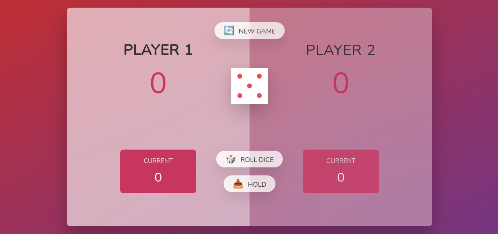

# DogGame 🎲🐶

Welcome to DogGame! A fun two-player game where players take turns rolling the dice 🎲 and accumulating points. The goal is to be the first player to reach a total score of 100 or more.

## How to Play 🕹️

1. DogGame is a two-player game, with Player One going first.
2. On a player's turn, they roll a six-sided dice.
3. If the dice roll is not a one:
   - The current player's score increases by the value of the dice roll.
   - The player can choose to either roll again or hold.
4. If the dice roll is a one:
   - The current player's score resets to zero.
   - The turn passes to the other player.
5. To "hold":
   - The current player's current score is added to their total score.
   - The turn passes to the other player.
6. Players take turns rolling the dice and deciding whether to roll again or hold until one player reaches a total score of 100 or more.

## Additional Button 🔁

- There is an additional button available that resets the game. If any player presses it, the game will be reset, and scores will be cleared.

## Rules 📜

- The game starts with Player One rolling the dice.
- Players must roll the dice at least once on their turn.
- If a player rolls a one, they lose all their current points for that turn.
- The first player to reach a total score of 100 or more wins the game.

## Technologies Used 💻

- This game is built using JavaScript.

## Demo 📸

You can see a live demo of the game [here](https://dog-game.netlify.app/).

## How to Run 🚀

To play DogGame:

1. Download or clone the DogGame repository.
2. Open the `index.html` file in a web browser.
3. Follow the on-screen instructions to play the game.

## Enjoy Playing! 🐾

Have fun playing DogGame with your friends! May the best dog win! 🎉
